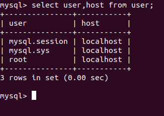
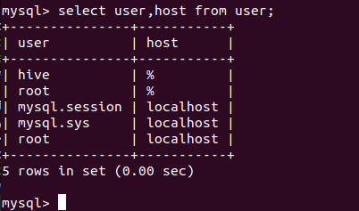

> 安装到slave1,用来做hive元数据

使用yum安装,现在官网下载mysql的源的rpm包

### 下载rpm包安装源

mysql community下载

https://dev.mysql.com/downloads/,centos 选择Yum的


将下载的 [mysql80-community-release-el7-3.noarch.rpm](https://repo.mysql.com//mysql80-community-release-el7-3.noarch.rpm)复制到centos 系统,或者在centos里用wget下载

```
curl  https://repo.mysql.com//mysql80-community-release-el7-3.noarch.rpm -o mysql80-community-release-el7-3.noarch.rpm 
```

安装mysql源

```
 rpm -i  mysql80-community-release-el7-3.noarch.rpm 
```

安装后可以在`/etc/yum.repos.d/`找到mysql的源

```
[root@slave1 ~]# ll /etc/yum.repos.d/
total 40
-rw-r--r--. 1 root root 1664 11月 23 2018 CentOS-Base.repo
-rw-r--r--. 1 root root 1309 11月 23 2018 CentOS-CR.repo
-rw-r--r--. 1 root root  649 11月 23 2018 CentOS-Debuginfo.repo
-rw-r--r--. 1 root root  314 11月 23 2018 CentOS-fasttrack.repo
-rw-r--r--. 1 root root  630 11月 23 2018 CentOS-Media.repo
-rw-r--r--. 1 root root 1331 11月 23 2018 CentOS-Sources.repo
-rw-r--r--. 1 root root 5701 11月 23 2018 CentOS-Vault.repo
-rw-r--r--. 1 root root 2076 4月  24 13:35 mysql-community.repo
-rw-r--r--. 1 root root 2108 4月  24 13:35 mysql-community-source.repo

```


### 安装

`yum install mysql-server`

#### 安装5.7版本

如果直接用上面命令，安装的是最新版的8.0,想要安装5.7版的MySQL需要修改repo文件

编辑` mysql-community.repo `文件

- 将mysql 5.7段的enabled值改成1
- 80的改成0

这样用上面命令安装的就是5.7版本的

### 启动mysql服务

```
刚安装完是没有启动的
service mysqld start
```

### 密码设置

1. 用临时密码登录
2. 修改密码(这时只能修改成一个复杂密码 ,至少8个字符+有数字+有大写字符+有小写字符+有特殊符号
3. 设置密码的安全策略为低(Low),设置密码最少长度为0 ,这样就能修改成任意密码了

临时密码获取:

启动后会生成一个随机密码，查看`/var/log/mysqld.log`文件获取


使用随机密码登录


官方文档:

https://dev.mysql.com/doc/refman/5.7/en/validate-password.html

修改密码


```
修改密码代码
ALTER USER USER() IDENTIFIED BY 'Abc1234?';
```

查看下密码策略


validate_password_policy 现在是 MEDIUM,其他的值是LOW和STRONG

是LOW时需要满足[`validate_password_length`](https://dev.mysql.com/doc/refman/5.7/en/validate-password-options-variables.html#sysvar_validate_password_length).这个变量的值

是MEDIUM时需要满足下面三个值

[`validate_password_number_count`](https://dev.mysql.com/doc/refman/5.7/en/validate-password-options-variables.html#sysvar_validate_password_number_count),          [`validate_password_mixed_case_count`](https://dev.mysql.com/doc/refman/5.7/en/validate-password-options-variables.html#sysvar_validate_password_mixed_case_count),          [`validate_password_special_char_count`](https://dev.mysql.com/doc/refman/5.7/en/validate-password-options-variables.html#sysvar_validate_password_special_char_count).        

如果要修改密码为root,首先先将`validate_password_policy`改成LOW,在修改`validate_password_length`的值为0

修改全局变量

```
设置密码策略
set global validate_password_policy='LOW'
修改最短长度
set global validate_password_length=0

修改为简单密码
ALTER USER USER() IDENTIFIED BY 'root';
mysql> ALTER USER USER() IDENTIFIED BY 'root';
Query OK, 0 rows affected (0.00 sec)
成功
```


### 创建用户和设置root用户远程登录

查看下当前的用户



- root用户现在只能localhost本地登录

创建一个hive用户

```mysql
create user 'hive'@'%' identified by 'hive';
创建一个数据库 hivemeta
create database hivemeta ;
//授予权限给hive
grant all on hivemeta.* to hive;

```

设置root远程登录

```mysql
 grant  all privileges on *.* to 'root'@'%' identified by 'root' with grant option;

```

查看用户

